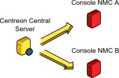

============
Exploitation
============

Generals Principles
-------------------

Centreon-newtestd is a Perl program in charged to get back Newtest services. This program uses the newtest webservice in order to connect and get back the informations of one (or more) Newtest Management Console (NMC).

By default "centreon-newtestd" starts one processes and that process launchs sub-processes (it depends of the configuration) :

Steps of operation :

- A sub-process is launched.
- The sub-process get Centreon datas: robots and scenarios already configured.
- The sub-process gets from the NMC the list of robots and scenarios: it creates it in centreon with centreon-clapi (It don't disable it or delete it in Centreon).
- The sub-process gets from the NMC the last status of scenarios: it submits through "centcore" the result.

Centreon-newtestd necessitates the utilization of one (or more) NMC.

Operating mode
--------------

The "centreon-newtestd" program only works in daemon mode.

Daemon configuration
-----------------------

The « centreon-newtestd » daemon is configured with the « centreon_newtestd.pm » configuration file ::
 
    %centreon_newtestd_config = (
        1 => { date => '* * * * *', arguments => {
                                                    nmc_endpoint => 'http://__NMC_ADDRESS__/nws/managementconsoleservice.asmx', 
                                                    timeout => 10,
                                                    host_template => 'generic-active-host', host_prefix => 'Robot-%s',
                                                    service_template => 'generic-passive-service', service_prefix => 'Scenario-%s',
                                                    poller_name => 'Central',
                                                    clapi_command => '/usr/share/centreon/www/modules/centreon-clapi/core/centreon', 
                                                    clapi_username => 'admin', clapi_password => 'centreon',
                                                    clapi_action_applycfg => 'POLLERRELOAD',
                                                    ListScenarioStatus => { search => 'All', instances => [] } 
                                                 } },
        2 => { date => '0-59/5 * * * *', arguments => { 
                                                    nmc_endpoint => 'http://__NMC_ADDRESS__/nws/managementconsoleservice.asmx', 
                                                    timeout => 10,
                                                    host_template => 'generic-active-host', host_prefix => 'Robot-%s',
                                                    service_template => 'generic-passive-service', service_prefix => 'Scenario-%s',
                                                    poller_name => 'Central',
                                                    clapi_command => '/usr/share/centreon/www/modules/centreon-clapi/core/centreon', 
                                                    clapi_username => 'admin', clapi_password => 'centreon',
                                                    clapi_action_applycfg => 'POLLERRELOAD',
                                                    ListScenarioStatus => { search => 'Robot', instances => ['XXXX'] } 
                                                  } },
    );

You have to add at least one entry in the configuration. The meaning of attributes :

- 'date': crontab format to configure the sub-process scheduling
- 'nmc_endpoint': address of the NMC
- 'timeout': timeout NMC console response
- 'host_template': template used when the daemon creates a host in Centreon
- 'host_prefix': name used when the daemon creates and looks for a host in Centreon
- 'service_templte': template used when the daemon creates a service in Centreon
- 'service_prefix': name used when the daemon creates and looks for a service in Centreon
- 'poller_name': poller used when the daemon creates a host in Centreon
- 'clapi_username' and 'clapi_password': centreon-clapi connections 
- 'clapi_action_applycfg': could be 'POLLERRELOAD' or 'POLLERRESTART'
- 'ListScenarioStatus': informations to gets from NMC :
   - To get all robots: { search => 'All', instances => [] } 
   - To filter on some robots: { search => 'Robot', instances => ['XXXX', 'YYYY'] }

Troubleshooting
---------------

It is possible to get this kind of errors in the « logs » of « centreon-newtestd » ::

    die: syntax error at line 1, column 0, byte 0 at /usr/lib/perl5/vendor_perl/5.8.8/i386-linux-thread-multi/XML/Parser.pm line 189

It often means that there is a timeout error.